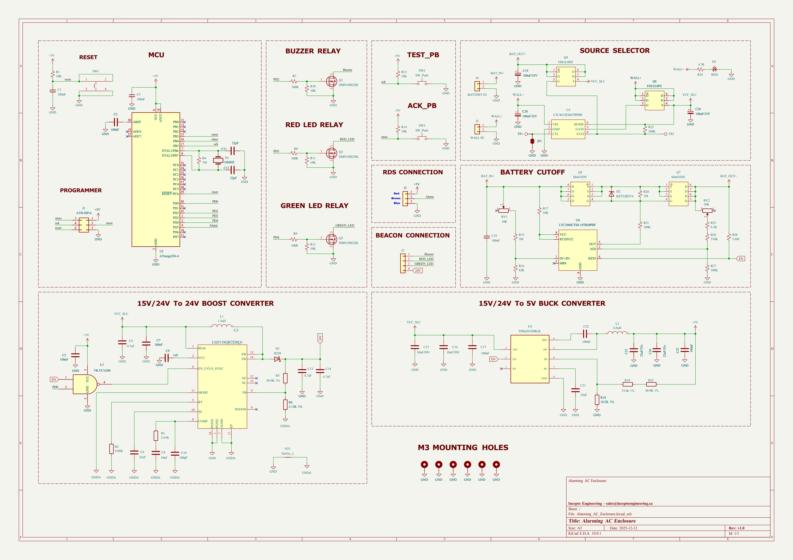
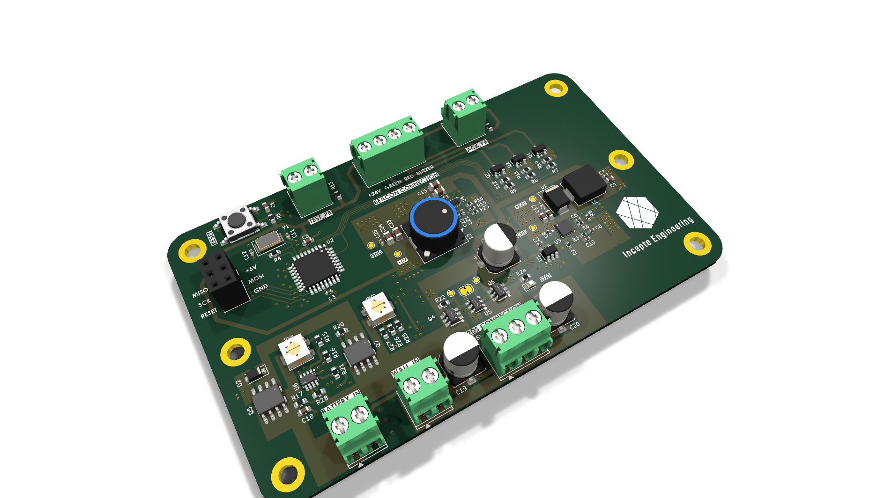
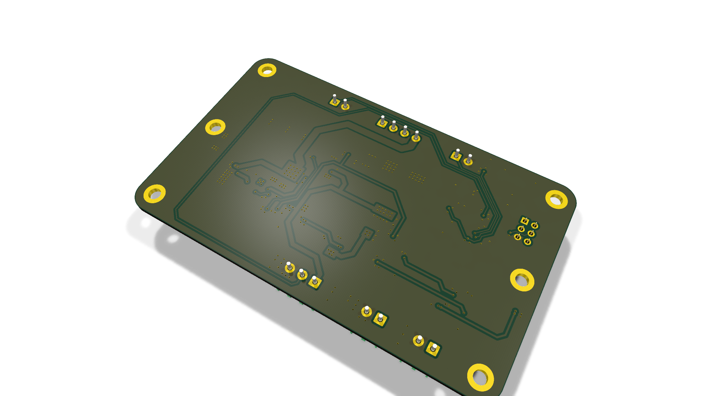
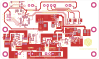

# Alarming_AC_Enclosure

ATmega328-based AC enclosure tamper/intrusion alarm with PowerPath, voltage monitoring, and dual switching converters

## At a Glance

- **Status**: In progress
- **Board size**: 100 x 60 mm
- **Layers**: 2
- **Components**: 98
- **Key ICs**:
  - U1: 74LVC1G00
  - U2: ATmega328-A
  - U3: LM5158QRTERQ1
  - U4: TPS62933DRLR
  - U5: LTC4412ES6#TRPBF
  - U6: LTC2960CTS8-1#TRMPBF

## Schematic

Full PDF: [reports/schematic.pdf](reports/schematic.pdf)

## Component Roles

- **ATmega328-A** - main MCU; reads tamper switches, manages alarm state, drives outputs
- **LTC4412ES6** - low-loss ideal-diode / PowerPath controller; manages source switching between mains-derived rail and backup battery seamlessly
- **LTC2960CTS8-1** - precision voltage monitor / supervisor; trips the alarm if either supply rail dips out of spec
- **LM5158QRTERQ1** - automotive-grade boost converter (LM5158-Q1); steps up battery voltage to feed the alarm load when on backup
- **TPS62933PDRLR** - low-Iq buck converter for the MCU rail (long battery standby)
- **DMN10H220L** - N-channel MOSFET for high-side / load switching
- **FDC610PZ** - P-channel MOSFET (complementary side for OR-ing / load isolation)
- **B220** - Schottky diode for reverse / OR-ing logic
- **BZT52Bxx** - zener diode for clamp / reference
- **1TS005F-2500-5001** - tactile reset/test switch
- **74LVC1G00** - single 2-input NAND gate for combining tamper inputs / debounce logic
- **Crystal** for ATmega clock

> Designed as a self-powered enclosure tamper alarm: stays armed on AC, falls back to battery when AC is cut, alerts when either supply rail is out of spec.

## PCB

**Top copper**

**Bottom copper**

## Bill of Materials

| Refs | Value | Footprint | Qty | MPN | LCSC |
|------|-------|-----------|----:|-----|------|
| C1,C5,C18 | 100nF | Capacitor_SMD:C_0603_1608Metric | 3 |  |  |
| C2,C3,C7,C17,C22,C25 | 100nF | Capacitor_SMD:C_0402_1005Metric | 6 |  |  |
| C4,C13,C14 | 4.7uF | Capacitor_SMD:C_0603_1608Metric | 3 |  |  |
| C6 | 22nF | Capacitor_SMD:C_0402_1005Metric | 1 |  |  |
| C8 | 10nF | Capacitor_SMD:C_0402_1005Metric | 1 |  |  |
| C9 | 1uF | Capacitor_SMD:C_0402_1005Metric | 1 |  |  |
| C10 | 100pF | Capacitor_SMD:C_0402_1005Metric | 1 |  |  |
| C11,C12 | 22pF | Capacitor_SMD:C_0402_1005Metric | 2 |  |  |
| C15,C16 | 10uF/50V | Capacitor_SMD:C_0805_2012Metric | 2 |  |  |
| C19,C20,C26 | 100uF/35V | Capacitor_SMD:CP_Elec_6.3x7.7 | 3 |  |  |
| C21 | 33nF | Capacitor_SMD:C_0402_1005Metric | 1 |  |  |
| C23,C24 | 22uF/35v | Capacitor_SMD:C_0805_2012Metric | 2 |  |  |
| D1 | B220 | Diode_SMD:D_SMB | 1 |  |  |
| D2 | BZT52B2V4 | Diode_SMD:D_SOD-123F | 1 |  |  |
| D3 | RED | LED_SMD:LED_0603_1608Metric | 1 |  |  |
| J1 | AVR-ISP-6 | Connector_PinSocket_2.54mm:PinSocket_2x03_P2.54mm_Vertical | 1 |  |  |
| J2 | Conn_01x04 | TerminalBlock_Phoenix:TerminalBlock_Phoenix_PT-1,5-4-3.5-H_1x04_P3.50mm_Horizontal | 1 |  |  |
| J3 | Conn_01x03 | TerminalBlock_Phoenix:TerminalBlock_Phoenix_PT-1,5-3-3.5-H_1x03_P3.50mm_Horizontal | 1 |  |  |
| J4 | BATTERY IN | TerminalBlock_Phoenix:TerminalBlock_Phoenix_PT-1,5-2-3.5-H_1x02_P3.50mm_Horizontal | 1 |  |  |
| J5 | WALL IN | TerminalBlock_Phoenix:TerminalBlock_Phoenix_PT-1,5-2-3.5-H_1x02_P3.50mm_Horizontal | 1 |  |  |
| L1 | 1.5uH | Inductor_SMD:L_Sunlord_MWSA0603S | 1 |  |  |
| L2 | 6.8uH | Inductor_SMD:L_TDK_SLF10165 | 1 |  |  |
| Q1-Q3 | DMN10H220L | Package_TO_SOT_SMD:SOT-23 | 3 |  |  |
| Q4,Q6 | FDC610PZ | FDC610PZ:SOT-23-6_L2.9-W1.6-P0.95-LS2.8-BR | 2 |  |  |
| Q5,Q7 | SI4435DY | SI4435DY:SOP-8_L4.9-W3.9-P1.27-LS6.0-BL | 2 |  |  |
| R1,R10-R14,R17 | 10K | Resistor_SMD:R_0603_1608Metric | 7 |  |  |
| R2 | 9.09K | Resistor_SMD:R_0402_1005Metric | 1 |  |  |
| R3 | 2.61K | Resistor_SMD:R_0402_1005Metric | 1 |  |  |
| R4,R20 | 1M | Resistor_SMD:R_0603_1608Metric | 2 |  |  |
| R5 | 49.9K 1% | Resistor_SMD:R_0402_1005Metric | 1 |  |  |
| R6 | 2.15K 1% | Resistor_SMD:R_0402_1005Metric | 1 |  |  |
| R7-R9 | 100R | Resistor_SMD:R_0603_1608Metric | 3 |  |  |
| R15 | 3M | Resistor_SMD:R_0603_1608Metric | 1 |  |  |
| R16 | 82K | Resistor_SMD:R_0603_1608Metric | 1 |  |  |
| R18 | 10.2K 1% | Resistor_SMD:R_0402_1005Metric | 1 |  |  |
| R19 | 53.6k 1% | Resistor_SMD:R_0402_1005Metric | 1 |  |  |
| R21,R22,R27 | 100K | Resistor_SMD:R_0603_1608Metric | 3 |  |  |
| R23 | 49.9R 1% | Resistor_SMD:R_0402_1005Metric | 1 |  |  |
| R24 | 4.7K | Resistor_SMD:R_0603_1608Metric | 1 |  |  |
| R25 | 4.3K | Resistor_SMD:R_0603_1608Metric | 1 |  |  |
| R26 | 510K | Resistor_SMD:R_0603_1608Metric | 1 |  |  |
| R28 | 5.6M | Resistor_SMD:R_0603_1608Metric | 1 |  |  |
| RV1,RV2 | 10K | Potentiometer_SMD:Potentiometer_Bourns_3314J_Vertical | 2 |  |  |
| SW1 | 1TS005F-2500-5001 | 1TS005F-2500-5001:SW-SMD_4P-L6.0-W6.0-P4.50-LS9.0-H2.5 | 1 |  |  |
| SW2,SW3 | SW_Push | TerminalBlock_Phoenix:TerminalBlock_Phoenix_PT-1,5-2-3.5-H_1x02_P3.50mm_Horizontal | 2 |  |  |
| TP1,TP2 | TestPoint | TestPoint:TestPoint_Pad_D1.5mm | 2 |  |  |
| U1 | 74LVC1G00 | Package_TO_SOT_SMD:SOT-23-5 | 1 |  |  |
| U2 | ATmega328-A | Package_QFP:TQFP-32_7x7mm_P0.8mm | 1 |  |  |
| U3 | LM5158QRTERQ1 | Package_DFN_QFN:WQFN-16-1EP_3x3mm_P0.5mm_EP1.68x1.68mm | 1 |  |  |
| U4 | TPS62933DRLR | Package_TO_SOT_SMD:SOT-583-8 | 1 |  |  |
| U5 | LTC4412ES6#TRPBF | LTC4412ES6#TRPBF:TSOT-23-6_L2.9-W1.6-P0.95-LS2.8-BR | 1 |  |  |
| U6 | LTC2960CTS8-1#TRMPBF | LTC2960CTS8-1#TRMPBF:TSOT-23-8_L2.9-W1.6-P0.65-LS2.8-BL | 1 |  |  |
| Y1 | 16MHZ | Crystal:Crystal_SMD_5032-2Pin_5.0x3.2mm | 1 |  |  |

_53 of 53 line items don't have an LCSC code in the schematic - search [LCSC](https://www.lcsc.com/) or [JLC parts search](https://jlcsearch.tscircuit.com/) by MPN or footprint when sourcing._

## Files

- `Alarming_AC_Enclosure.kicad_pro` - KiCad project
- `Alarming_AC_Enclosure.kicad_sch` - schematic source
- `Alarming_AC_Enclosure.kicad_pcb` - PCB layout source
- `reports/schematic.pdf` - full schematic (printable)
- `reports/bom.csv` - bill of materials
- `reports/pcb-top.svg`, `reports/pcb-bottom.svg` - copper artwork
- `reports/board-stats.json` - KiCad-generated board statistics

---

_Renders and metadata auto-generated by `Backup-KiCadProject.ps1` using KiCad 10.0._

